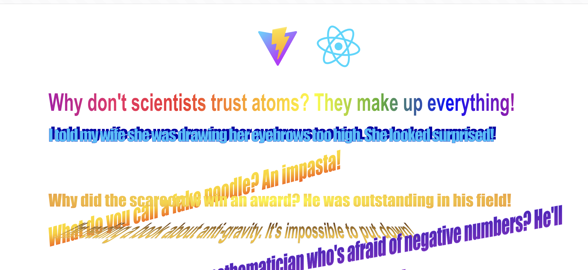

# React WordArt for Vite

This is a fork of [react-wordart](https://github.com/yershalom/react-wordart/tree/master) made to work using Vite instead of Create React App.

## Description

The nostalgic WordArt we know and love, now in React and compatible with Vite! This component lets you add that classic 90s WordArt style to your modern React applications.

## Usage

### Install deps

```sh
yarn
```

### Run

```sh
yarn dev
```
